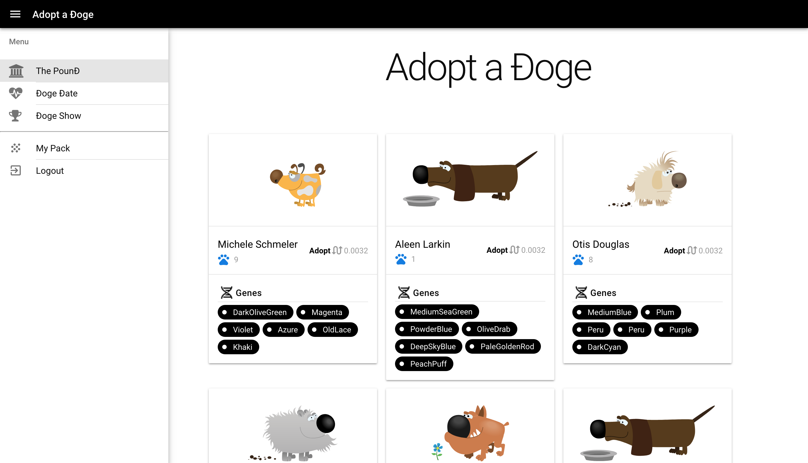

# DogeDate API



DogeDate Frontend URL: https://github.com/tommycox/dogedate-frontend

## Getting Started

```shell
# Clone both repositories
git clone git@github.com:tommycox/dogedate-backend.git
git clone git@github.com:tommycox/dogedate-frontend.git

# Setup Laravel
cd dogedate-backend
chmod -R a+rwX bootstrap/cache storage
cp .env.example .env

# Copy the seed images from the frontend into public files.
cp -R ../dogedate-frontend/src/statics/images storage/app/public/

# With Docker Compose (php-fpm + nginx + MySQL)
docker-compose up -d
docker-compose run composer install
docker-compose run php php artisan key:generate
docker-compose run php php artisan migrate
docker-compose run php php artisan db:seed
```

The frontend should be pre-configured to use your new Laravel backend URL.
